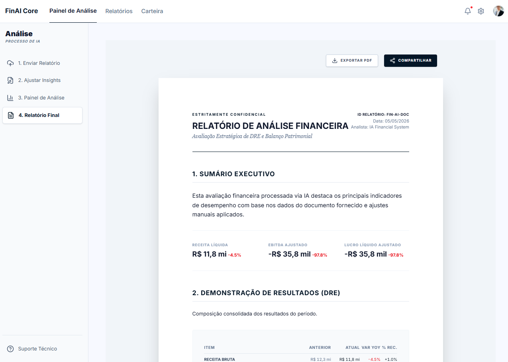

<div align="center">
  
</div>

# 🚀 Fin AI - Inteligência Financeira com Gemma 3 (Em desenvolvimento)

O **Fin AI** é uma plataforma avançada de análise financeira que utiliza o poder do modelo **Gemma 3 (27B)** da Google para transformar relatórios complexos em insights acionáveis. Projetado para analistas financeiros e investidores, o sistema automatiza a extração de dados de DRE (Demonstração de Resultados) e Balanço Patrimonial, permitindo ajustes manuais para eventos não recorrentes.

---

## ✨ Principais Funcionalidades

- **📂 Upload Inteligente**: Processamento automático de relatórios financeiros em formato PDF.
- **🧠 Motor de IA (Gemma 3)**: Extração precisa de métricas chave como Receita, EBITDA, Lucro Líquido e indicadores de Balanço.
- **⚖️ Ajustes Não Recorrentes**: Interface intuitiva para adicionar eventos extraordinários que impactam o resultado ajustado.
- **📊 Dashboard Interativo**: Visualização dinâmica com gráficos de barras comparativas (YoY).
- **📈 Análise Comparativa**: Comparação automática de períodos (Ano Atual vs. Ano Anterior) com cálculo de variação.
- **📄 Relatórios Profissionais**: Geração de visões detalhadas prontas para análise e tomada de decisão.

---

## 🛠️ Tecnologias Utilizadas

### Frontend
- **React 19 & TypeScript**: Interface moderna e tipagem estática para robustez.
- **Vite**: Build tool extremamente rápida para desenvolvimento.
- **Tailwind CSS 4**: Estilização baseada em utilitários para design responsivo e moderno.
- **Framer Motion**: Animações fluidas para uma experiência de usuário premium.
- **Recharts**: Gráficos interativos e customizáveis.
- **Lucide React**: Biblioteca de ícones elegantes.

### Backend
- **Python & FastAPI**: API de alto desempenho para orquestração e processamento.
- **Google GenAI SDK**: Integração nativa com o modelo Gemma 3 27B.
- **PyPDF**: Extração eficiente de texto de documentos PDF.
- **Pydantic**: Validação de dados e esquemas JSON rigorosos.

---

## 🚀 Como Executar o Projeto

### Pré-requisitos
- Node.js (v18+)
- Python (v3.10+)
- Chave de API do Google Gemini (para acesso ao Gemma 3)

### 1. Configuração do Backend
```bash
cd backend
uv sync
```
Crie um arquivo `.env` na pasta `backend`:
```env
GEMINI_API_KEY=sua_chave_aqui
```
Execute o servidor:
```bash
uv run main.py
```

### 2. Configuração do Frontend
```bash
bun install
```
Crie um arquivo `.env`.
Execute o app:
```bash
bun run dev
```

---

## 📂 Estrutura do Projeto

```text
fin-ai/
├── backend/            # API FastAPI e Integração com IA
│   ├── main.py        # Servidor principal e lógica da Gemma 3
├── src/               # Aplicação React
│   ├── components/    # Componentes UI (Dashboard, Report, etc.)
│   ├── services/      # Integração com API
│   ├── types/         # Definições de TypeScript
│   └── App.tsx        # Container principal
└── docs/              # Ativos de documentação (Banner, etc.)
```
